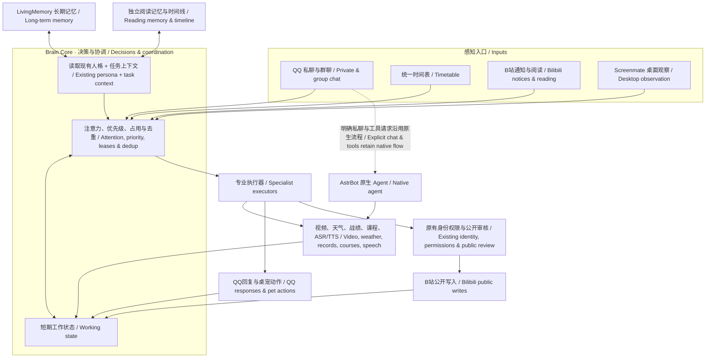

# 主脑总览图

[中文](architecture.md) | [English](architecture.en.md)

```mermaid
flowchart TB
 subgraph Inputs["感知入口 / Inputs"]
  QQ["QQ 私聊与群聊 / Private & group chat"]
  Timer["统一时间表 / Timetable"]
  Bili["B站通知与阅读 / Bilibili notices & reading"]
  Screen["Screenmate 桌面观察 / Desktop observation"]
 end
 subgraph Brain["Brain Core · 决策与协调 / Decisions & coordination"]
  Attention["注意力、优先级、占用与去重 / Attention, priority, leases & dedup"]
  State["短期工作状态 / Working state"]
  Persona["读取现有人格 + 任务上下文 / Existing persona + task context"]
 end
 QQ --> Attention
 Timer --> Attention
 Bili --> Attention
 Screen --> Attention
 Attention <--> State
 Persona --> Attention
 Memory["LivingMemory 长期记忆 / Long-term memory"] <--> Persona
 Reading["独立阅读记忆与时间线 / Reading memory & timeline"] <--> Persona
 Attention --> Executors["专业执行器 / Specialist executors"]
 Executors --> Tools["视频、天气、战绩、课程、ASR/TTS / Video, weather, records, courses, speech"]
 Executors --> Private["QQ回复与桌宠动作 / QQ responses & pet actions"]
 Executors --> Review["原有身份权限与公开审核 / Existing identity, permissions & public review"]
 Review --> Public["B站公开写入 / Bilibili public writes"]
 Tools --> State
 Private --> State
 Public --> State
 QQ -. "明确私聊与工具请求沿用原生流程 / Explicit chat & tools retain native flow" .-> Native["AstrBot 原生 Agent / Native agent"]
 Native --> Tools
```
实线表示已接入的职责关系，不代表每个事件都要额外调用模型。短期工作状态与长期记忆分开；公开写入保留审核，回执不等于公开可见或已读。Screenmate需要其独立桥接配套。详见[主脑说明](brain-core.md)和[使用示例图](examples.md)。
